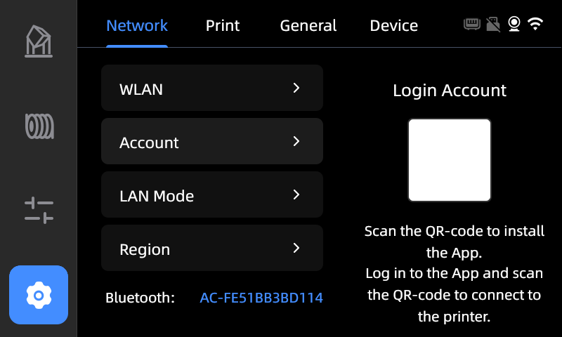
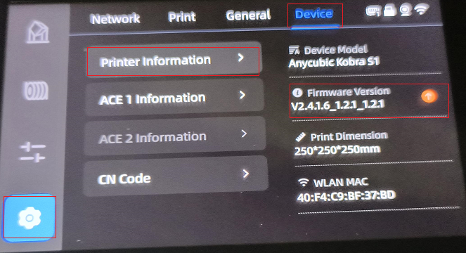
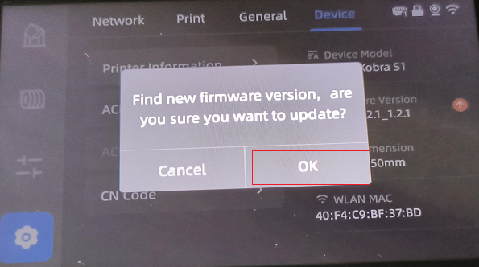
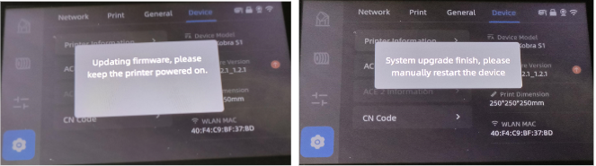

# Hướng dẫn cập nhật firmware Kobra S1

## 1.Liên kết máy in

Sau khi máy in được bật, vui lòng liên kết máy in theo các tài liệu dưới đây.

:::warning
Lưu ý: Máy in không thể cập nhật firmware khi đang ở chế độ LAN. Vui lòng tắt chế độ LAN trước khi tiến hành liên kết máy in.
:::

## 2. Cập nhật firmware

### Bước 1: Cập nhật firmware cho máy in

1. **Kiểm tra phiên bản firmware của máy in**:
   - Đầu tiên, nhấn vào biểu tượng "Cài đặt" → "Thiết bị" → "Thông tin máy in" từ màn hình hiển thị để kiểm tra xem phiên bản firmware có phải là phiên bản mới nhất không.
   - Nếu sau phiên bản firmware có xuất hiện mũi tên chỉ xuống, thì firmware của máy in không phải là phiên bản mới nhất, vui lòng nhấn vào mũi tên để nâng cấp.

   

2. **Cập nhật firmware**:
   - Màn hình hiển thị sẽ hiện lên để tìm phiên bản firmware mới, vui lòng nhấn **"OK"** để cập nhật firmware.

   

3. **Khởi động lại máy in**:
   - Sau khi cập nhật firmware xong, vui lòng khởi động lại máy in để kiểm tra xem firmware đã được cập nhật hay chưa.

   

### Bước 2: Cập nhật firmware cho ACE Pro

1. **Kiểm tra phiên bản firmware cho ACE Pro**:
   - Nhấn vào biểu tượng "Cài đặt" → "Thiết bị" → "Thông tin ACE 1" từ màn hình hiển thị để kiểm tra xem phiên bản firmware có phải là phiên bản mới nhất không.
   - Nếu sau phiên bản firmware có xuất hiện mũi tên chỉ xuống, thì firmware không phải là phiên bản mới nhất, vui lòng nhấn vào mũi tên để nâng cấp firmware.

2. **Cập nhật firmware ACE Pro**:
   - Màn hình hiển thị sẽ hiện lên để tìm phiên bản MCU ACE mới, vui lòng nhấn **"OK"** để cập nhật firmware.

3. **Hoàn thành cập nhật**:
   - Nhấn **"Xác nhận"** để hoàn thành việc cập nhật firmware cho ACE Pro.

## 3. Nhật kí cập nhật firmware

### V2.4.8.3

1. Thêm chức năng bỏ qua phần in: Người dùng có thể bỏ qua các phần không in được trên thiết bị.
2. Thêm hiệu chuẩn dòng chảy: Hiệu chuẩn dòng chảy trước khi in, chủ yếu cải thiện chất lượng in ở các góc.
3. Thêm hỗ trợ in 8 màu: Hỗ trợ in 8 màu.
4. Giảm tiếng ồn trong quá trình định vị và dò tìm: Giảm tốc độ di chuyển không tải của đầu in và điều chỉnh tốc độ nâng trục Z để giảm tiếng ồn trong quá trình định vị và dò tìm.
5. Tối ưu hóa hiệu quả căn chỉnh tự động: Tăng cường liên kết tiền làm nóng trước khi căn chỉnh (nhiệt độ mục tiêu của giường nóng tăng thêm 5°C), giúp giường nóng nhanh chóng đạt cân bằng nhiệt để cải thiện hiệu quả căn chỉnh.
6. Hỗ trợ tiền làm nóng tác vụ từ xa: Gửi tác vụ từ xa, tải file trước và làm nóng, tiết kiệm thời gian chờ.
7. Hoàn thiện vật liệu tiêu hao trước khi in: Hoàn thiện vật liệu tiêu hao trước khi in giảm nguy cơ vật liệu hoàn toàn ra khỏi kênh.
8. Sửa một số lỗi đã biết.
