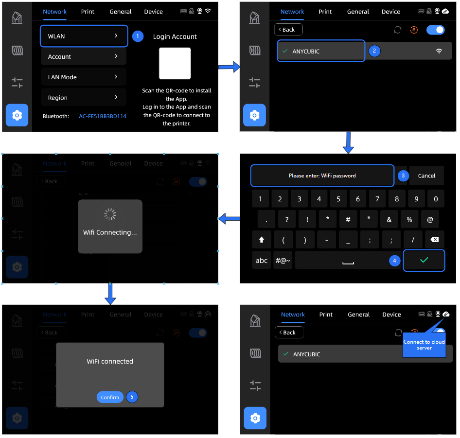
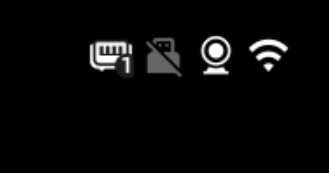

# Hướng dẫn kết nối mạng và xử lý sự cố cho máy in Kobra S1

## 1.Hướng dẫn kết nối mạng:

:::note Chuẩn bị trước khi kết nối
- **Chỉ kết nối với tín hiệu Wi-Fi băng tần 2.4GHz** của router. Thiết bị **không hỗ trợ băng tần 5GHz**.
- **Không hỗ trợ các mạng Wi-Fi có băng tần kết hợp** (2.4GHz và 5GHz phát cùng lúc).
- **Không hỗ trợ mạng yêu cầu xác thực thứ cấp**, như mạng Wi-Fi công cộng yêu cầu đăng nhập qua trình duyệt.
- **Không hỗ trợ kết nối qua proxy mạng**.
:::

### Kết nối mạng
1. Nhấn "Network" (Mạng)
2. Chọn "WLAN"
3. Tìm và chọn tên WiFi của bạn
4. Nhập mật khẩu WiFi, sau đó nhấn "OK"
5. Chờ máy kết nối WiFi
6. Khi kết nối thành công, biểu tượng đám mây sẽ xuất hiện ở góc trên bên phải màn hình, cho biết đã kết nối với máy chủ thành công.

## 2. Sửa lỗi:  
#### Lỗi 1: Kết nối thất bại 
1. Màn hình hiện thông báo: **"Kết nối mạng thất bại"**
→ Nguyên nhân: **Tên WiFi (SSID) và mật khẩu WiFi** không khớp, dẫn đến không thể kết nối.
2. **Vui lòng kiểm tra lại** xem **tên WiFi** và **mật khẩu WiFi** đã nhập có chính xác hay chưa.

#### Lỗi 2: Không thể kết nối đến máy chủ
1. Góc trên bên phải **chỉ hiển thị biểu tượng WiFi, không có biểu tượng đám mây**.
2. Kiểm tra xem **router có đang bật tường lửa (firewall) không – điều này có thể ngăn kết nối đến dịch vụ đám mây**.
3. Kiểm tra xem có đang kết nối vào **mạng WiFi yêu cầu xác thực phụ** (như mạng công cộng cần đăng nhập qua trình duyệt) không – thiết bị **không hỗ trợ loại mạng này**.

