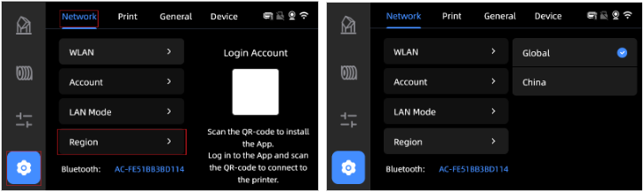
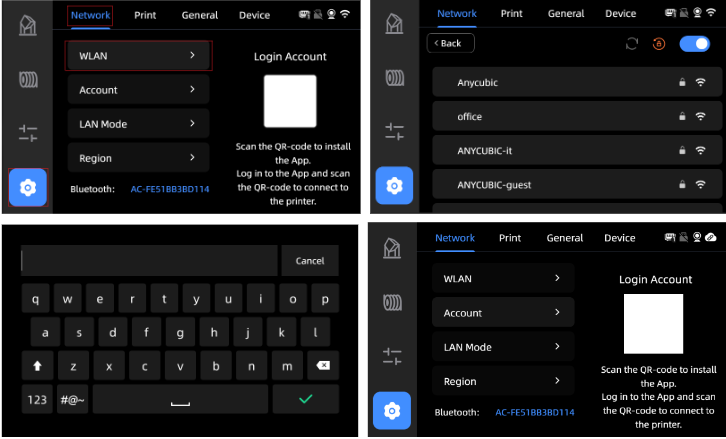
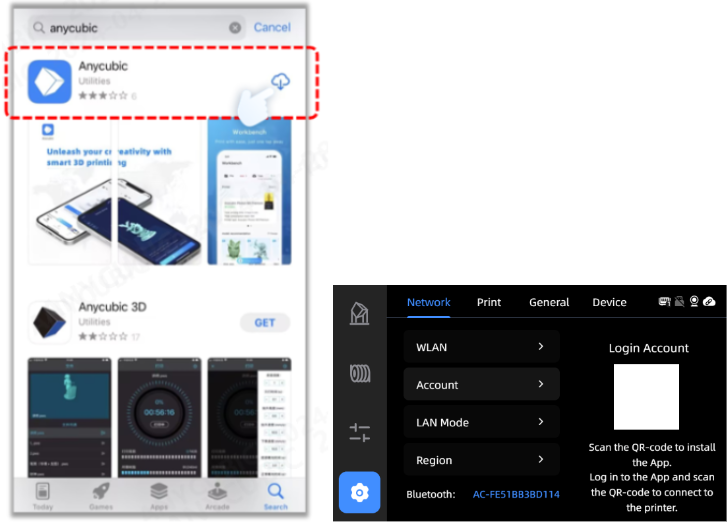
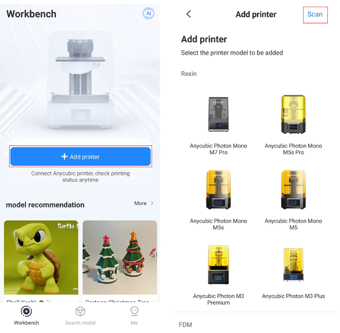

# Hướng Dẫn Liên Kết Máy In Kobra S1

---

## Bước 1: Chọn máy chủ (server)
- Sau khi bật máy in, nhấn vào biểu tượng "Cài đặt (Settings)"
- Chọn "Mạng (Network)" → "Khu vực (Region)"
- Sau đó đổi vị trí máy chủ thành "Global"

---

## Bước 2: Kết nối WiFi
- Từ màn hình cảm ứng, nhấn "Cài đặt (Settings)" → "Mạng (Network)" → "WLAN"
- Chọn tên WiFi bạn muốn kết nối
- Nhập mật khẩu WiFi, chờ kết nối thành công

---

## Bước 3: Liên kết máy in với ứng dụng
---
### Bước 3.1: Tải ứng dụng “Anycubic”
- Mở cửa hàng ứng dụng (**App Store** hoặc **CH Play**) và tìm **"Anycubic"**
- Hoặc quét mã QR hiển thị trên giao diện mạng của máy in để tải về
- Đăng ký tài khoản và đăng nhập vào ứng dụng

---

### Bước 3.2: Quét mã và liên kết máy in
- Trong ứng dụng, chọn:
**"Bàn làm việc (Workbench)"** → **"Thêm máy in (Add printer)"** → **"Quét (Scan)"**
- Quét mã QR hiển thị trên màn hình máy in để liên kết máy in với tài khoản

